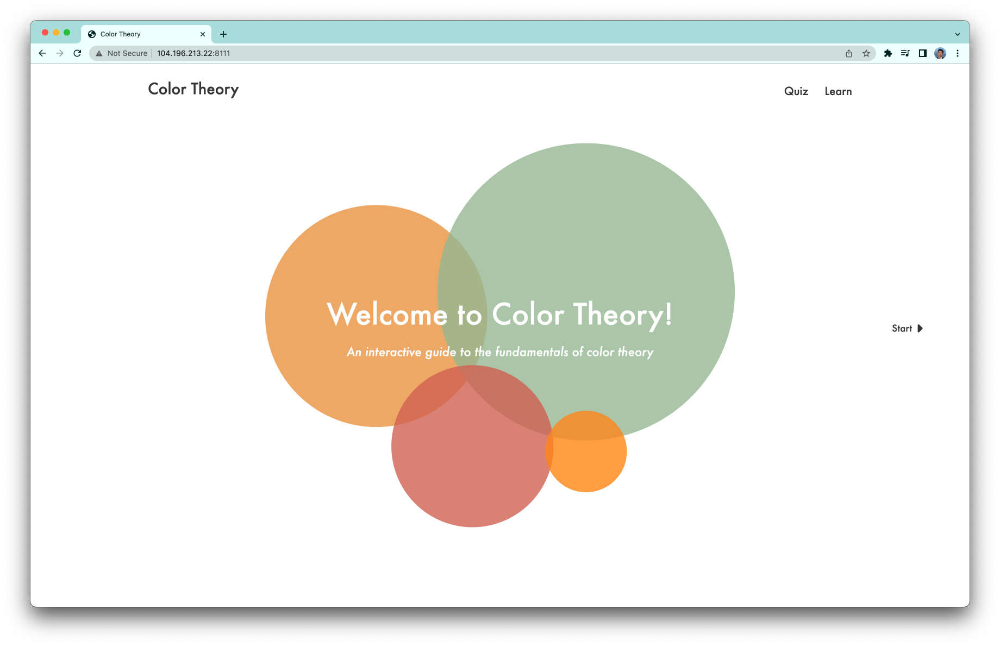

<h1 align="center">Color Theory</h1>

## Project Description

<strong>Color Thoery is a web application that allows users to explore and learn about fundamental concepts in color thoery through an interactive tutorial and quiz.</strong> (This is the final group project for <em>W4170 User Interface Design</em> at Columbia SEAS)

## Built With
- Javascript
- jQuery
- Python
- Flask
- HTML
- CSS

## Screenshots

## Authors
- [Leo Zhang](https://github.com/leozhvng23 "Leo Zhang")
- [Hanqin Zhou](https://github.com/JeanZHQ "Hanqin Zhou")
- [Jiyao Chen](https://github.com/jchenlukas "Jiyao Chen")
